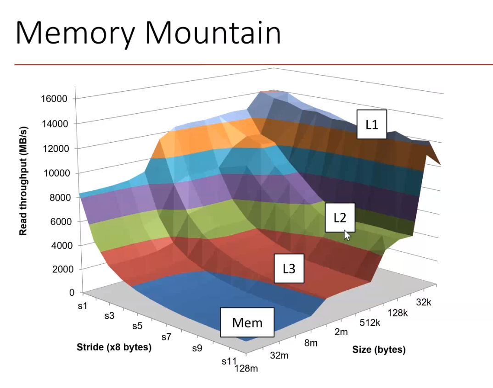

# Day 1: Computer Architecture Winter School

Single Core and Multicore Processor Architectures

- [1. OOO processing: Prof. Govindarajan](#1-ooo-processing-prof-govindarajan)
- [2. Caches and virtual memory: Prof. Biswa](#2-caches-and-virtual-memory-prof-biswa)
- [3. Multi-core architectures: Prof. Arkaprava Basu](#3-multi-core-architectures-prof-arkaprava-basu)
- [4. Lab (OOO+Cache performance)](#4-lab-ooocache-performance)
  - [4.1. Tasks](#41-tasks)
    - [4.1.1. Task-I](#411-task-i)
      - [4.1.1.1. Results and my observations](#4111-results-and-my-observations)
    - [4.1.2. Task-II (optional)](#412-task-ii-optional)
      - [4.1.2.1. Results and my observations](#4121-results-and-my-observations)

## 1. OOO processing: Prof. Govindarajan

Evolution of processor architecture:

- Microprocessors
- RISC
- ILP Processors:
  - EPIC (Explicitly parallel instruction computing)
  - VLIW (Very Long Instruction Word). Compiler puts multiple instructions that can be executed in parallel together
  - SuperScalar (stood the test of time until today)
- Multi-Cores
- Accelerators

- IPC Instruction per cycle. (Throughput of pipeline execution)
- ILP architecture aims to improve IPC further. Ability to fetch, decode, execute multiple instructions
  - Removes non-essential sequentiality and achieves parallel execution (only where there is no dependency (control/data), semantic specification in instruction stream must be maintained)


- Unlike VLIW, in superscalar, hardware detects which instructions can be parallel at run-time. In-Order or Out-of-Order issue

Superscalar execution model:

- Instructions wait in the instruction window till all dependencies are satisfied 
- Execution might happen OOO but values goes into destination register/commit happens in program in-order

## 2. Caches and virtual memory: Prof. Biswa

[Slides](./CAWS-cache.pdf)
```
Bandwidth Problems can be cured with money. Latency problems are harder because the speed of light is fixed - you can't bribe God.
```

- Laws of Performance:
  - Amdahl's law: Make the common case fast (even when program is not memory intensive)


- LRU suffers from thrashing when working set > cache size. Commercial processors today use RRIP
- MSHR (Miss Staus Holding register), to implement memory level parallelism


Prepare graph:


- Hit Rate, Miss Rate don't convey the right information as it does not mention the instructions. We use MPKI instead





## 3. Multi-core architectures: Prof. Arkaprava Basu

[Slides](./CAWS_2020_Multicores_and_Coherence.pdf)


## 4. Lab (OOO+Cache performance)

- Warmup is used to avoid compulsory/cold start misses before measuring IPC
- ChampSim in the recent times is recommended by ISCA for microarchitecture research. This allows using traces (of instruction stream) to simulate a O3 processor

### 4.1. Tasks

#### 4.1.1. Task-I

The goal of this lab is to determine the size of L1D, L2, and the last-level cache (LLC, a.k.a. L3). This can be done by using variations of a program that accesses an array of a specific size, say 16KB, 32KB, or 64KB, and then observing the instruction per cycle (IPC) difference. If at a specific cache size, there
is an IPC drop, then that means that the previous cache size was the size of the cache. Going from 4KB to 4MB, you will first get the size of L1D, then L2, and finally LLC.

You need to do the following steps:-

1. Clone this GitHub repository: https://github.com/vishalgupta97/CAWS-LAB.git
2. Go through cache-code.c in the repository.
3. Generate traces using cache-code.c to access different array sizes (Input parameter to the program: log2 of the array size to be accessed, 4KB: 12, 8KB: 13, and so on). Generate traces to access array sizes starting from 4KB to 8MB with different names (use -o parameter with the Pintool to specify the output trace name). Skip the first 10 million instructions and generate traces for the next 2 million instructions. Use -ifeellucky parameter with the Pintool. Compress the trace files to .gz format.
    - Created traces [here](./day1/lab_day1/CAWS-LAB/ChampSim/tracer/cache_code_traces)
    - -s 10000000 -t 2000000
    - Compile with gcc cache-code.c -o cache_access. Run it for all configurations using the runtime parameter
4. Build ChampSim with LRU replacement policy and no prefetchers.
5. Run the generated traces with a warmup of one million and simulation of one million instructions.
6. Note the difference in IPC, find the size of the caches, and verify the sizes by checking in the ChampSim file: inc/cache.h
7. Double the sizes of L1D, L2, and LLC by doubling the number of sets or ways and then repeat steps 3-5.

##### 4.1.1.1. Results and my observations

- The IPC drops at 3places, L1D size, L2 size and LLC size
- We see that on sizes larger than the nearest cache , everything is a MISS in the log (eg. 64K L1 results in all MISS at L1). Would thrashing be the right term for this behavior? (downside of LRU)
  - Check the MISS RATE. certainly thrashing but downside of LRU emmmm kinda
    - For 64K access and L1D=32K I see the following which probably translates to near 100% miss rate. L1D TOTAL ACCESS:166669  HIT:2  MISS:166667
      - Yup. It is thrashing.


#### 4.1.2. Task-II (optional)

1. In the cache-code.c file, make the following changes: comment line no. 20-23 and un-comment line no. 25-34. Repeat steps 2-5 mentioned above to generate and run the traces. Observe the change in IPC and reason about it.
2. Repeat steps 3-5 to generate and run the traces with the IP stride prefetcher at L1D. Observe the change in IPC and reason about it.

##### 4.1.2.1. Results and my observations

- My progress [here](./day1/lab_day1/CAWS-LAB/ChampSim/tracer/cache_code_traces_task2)
- In task 1 there is a sequential dependency (access+j). But in task 2 there is not, so because we are using O3 (concurrent to L1-D cache) we don't see a drop on using a different access pattern
- Prefetcher able to hide latency L1/L2 cache. But if it is a miss in LLC there is a drop


- Steps followed

```bash
gcc cache-code.c -o cache_access_code
source cache_code_traces_task2/generate_all_traces 
xz * 
cp ~/work/caws2020/day1/lab_day1/CAWS-LAB/ChampSim/tracer/cache_code_traces_task2/generated_traces dpc3_traces -r 
./build_champsim.sh bimodal no ip_stride no no lru 1
source champsim_tracer_stride 
cd results_1M/
grep "CPU 0 cumulative IPC" ./* -r 
```