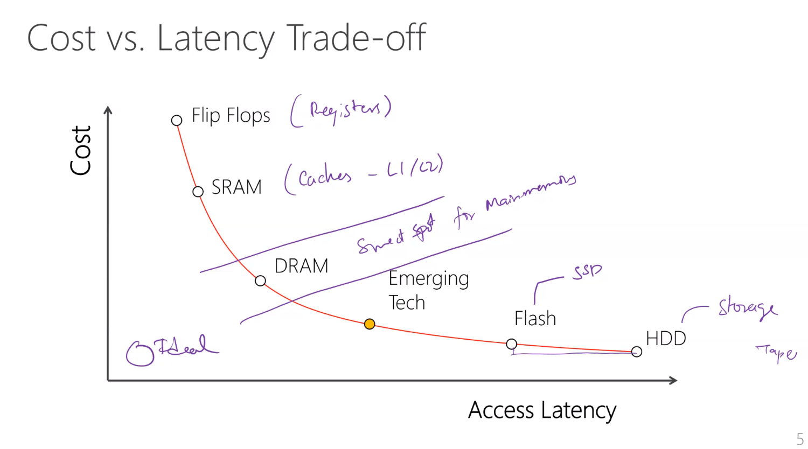
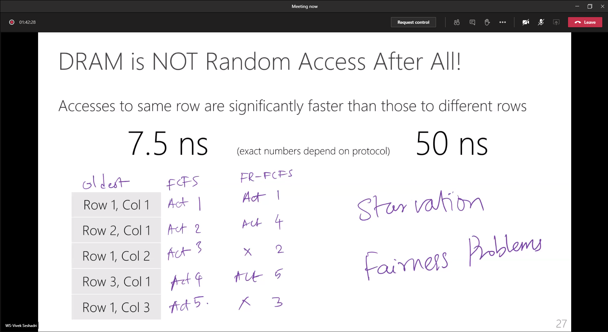

# Day 2: Memory Systems: Manu Awasthi and Vivek Seshadri

- [DRAM architecture, related performance issues and optimizations: Vivek Seshadri](#dram-architecture-related-performance-issues-and-optimizations-vivek-seshadri)
- [Lab on DRAM: Day 2](#lab-on-dram-day-2)

## DRAM architecture, related performance issues and optimizations: Vivek Seshadri

- Memory is the critical bottleneck/ central point to the idea of Von Neumann architectures
- SSD is not a technology rather than implementation. Flash is the underlying technology. Similarly, DRAM (tech), HBM (implementation)
- We are striving to get to a memory that takes the best of all worlds. Cost is driven by density

- DRAM ecosystem is unique. Memory controller is made by companies like Intel, but Memory manufacturing happens by someone else

- Memory controller handles FR-FCFS or other scheduling queues

## Lab on DRAM: Day 2

[Tasks and Progress](./day2/lab_day2)