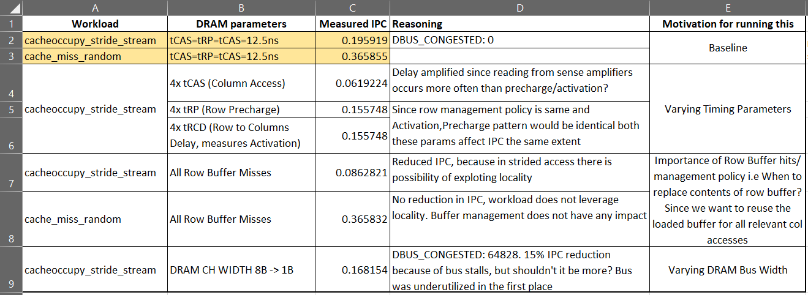

# CAWS (Day - 2) 22/12/2020

- [Task-1 (Generate Traces)](#task-1-generate-traces)
- [Task-2 (Varying Timing Parameters)](#task-2-varying-timing-parameters)
- [Task-3 (Importance of row buffer hits)](#task-3-importance-of-row-buffer-hits)
- [Task-4 (Vary DRAM_CHANNEL_WIDTH)](#task-4-vary-dram_channel_width)
- [My Observations](#my-observations)

The goal of this lab is to introduce you to the different parameters of the DRAM that control the IPC that you get and how their effect on different types of workloads. Do note that all tasks are independent of each other so make sure to undo all your edits before moving onto the next one.

## Task-1 (Generate Traces)

- Clone https://github.com/CMU-SAFARI/Cache-Memory-Hog.git
- Compile the cacheoccupy_stride_stream.c and cache_miss_random.c workload. [Here](./day2/lab_day2/Cache-Memory-Hog)
  - gcc -O0 cacheoccupy_stride_stream.c -o cacheoccupy_stride_stream
  - gcc -O0 cache_miss_random.c -o cache_miss_random
    - Use the -O0 flag to disable compiler optimization since it tries to figure out the access patterns beforehand and may interfere with the effectiveness of the hogs.
- Generate a trace for cacheoccupy_stride_stream and cache_miss_random  workload.
  - My traces [here](./day2/lab_day2/ChampSim/tracer/memory_hog_day2_traces)
- Run the traces with ChampSim with 1-core configuration using lru replacement policy and without any prefetchers. Note the IPC.
  - Measured IPC:
    - cache_miss_random:
    - cacheoccupy_stride_stream: 

## Task-2 (Varying Timing Parameters)

- The inc/dram_controller.h file has macros that define the timing parameters (Lines 11-13).
- For each of tCAS, tRP, tRCD, quadruple them individually.
- Rebuild ChampSim and run the trace for cacheoccupy_stride_stream workload.

Do you see a change in IPC? Is the IPC more sensitive to one of the timing parameters? If yes, could you comment why?

## Task-3 (Importance of row buffer hits)

In src/dram_controller.cc comment all code in Lines 133-183. This will ensure that all your accesses result in row buffer misses.
Rebuild ChampSim and run the trace for cacheoccupy_stride_stream workload and note the IPC
Run it for the cache_miss_random workload as well.

Do you see a difference in the reduction of IPC’s in both cases? Why do you think this happens?

## Task-4 (Vary DRAM_CHANNEL_WIDTH)

The inc/dram_controller.h file has a macro for DRAM_CHANNEL_WIDTH (Line 7). 
Decrease the DRAM_CHANNEL_WIDTH to 1.
Rebuild ChampSim and run the trace for cacheoccupy_stride_stream workload.
Note the IPC and DBUS_CONGESTED metrics from the result file.

How much did the IPC fall? Why do you think the change occurred?

## My Observations

