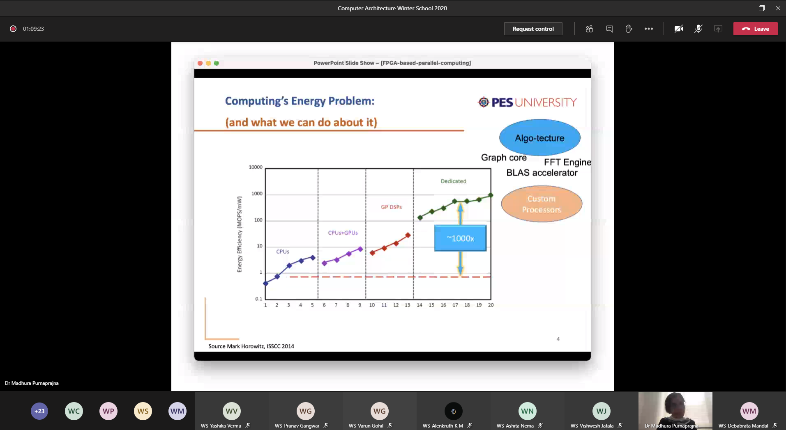
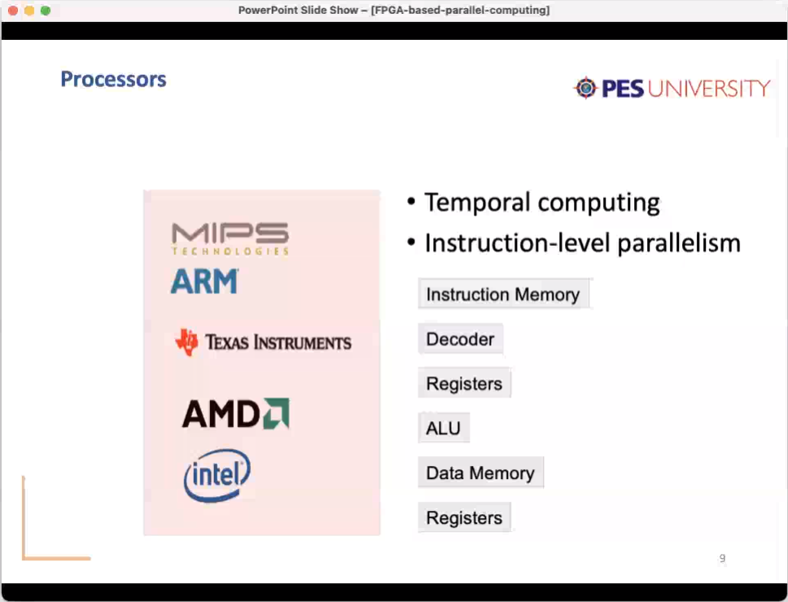
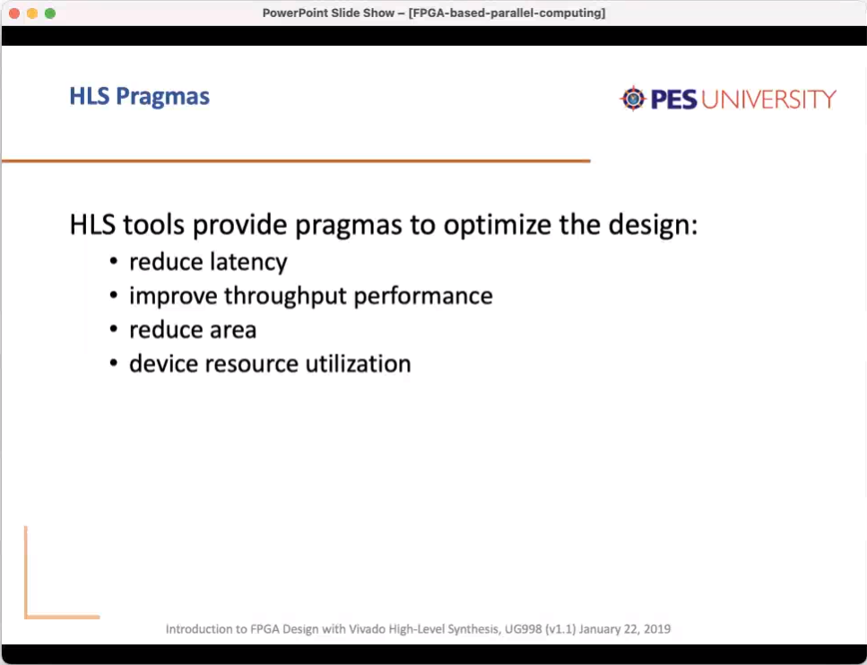
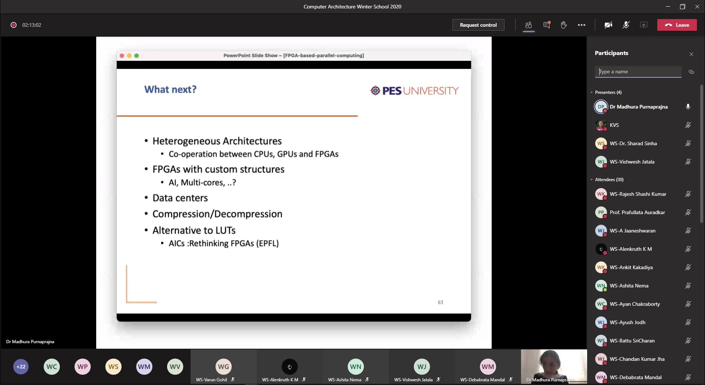
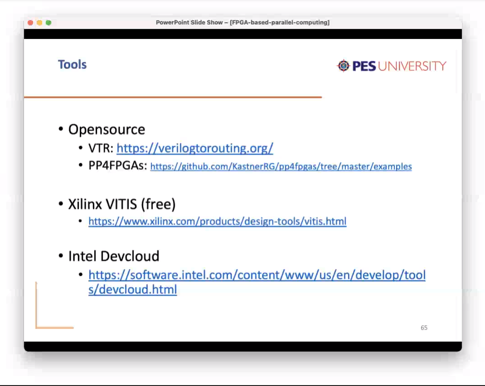

# Day 3: Heterogeneous Architectures

- [FPGA and Parallel computing: Prof. Madhura Purnaprajna](#fpga-and-parallel-computing-prof-madhura-purnaprajna)
- [GPU architectures and Programming](#gpu-architectures-and-programming)

## FPGA and Parallel computing: Prof. Madhura Purnaprajna

FPGAs are centred towards spatial computing

## GPU architectures and Programming

- We only specify thread configuration (threadblocks and threads). But the SM schedulers internally decides the groups of warps etc.