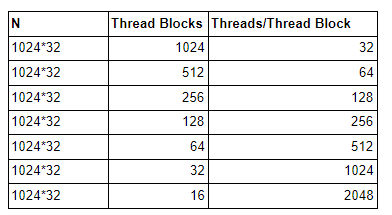

# CAWS Day-3 Lab

The goal of this lab is to help you understand some basics in writing cuda programs and understand their performance differences.

Instruction for setup:

Note that to run your CUDA program, you require a CUDA capable device. In this lab, we will use Google Colab platform. It provides a jupyter notebook hosted by Google cloud machines that can support GPUs.

Please follow the instruction in the below link to setup your GPU environment in the Google Colab:

https://www.geeksforgeeks.org/how-to-run-cuda-c-c-on-jupyter-notebook-in-google-colaboratory/

Note: If the CUDA is already installed (in Step-5), you can omit Step-3 and Step-4

## Task-1: (Writing simple CUDA program)

For a given integer a and two arrays X and Y (both of size N), write a CUDA program to compute an array Z, such that C = a*X+Y.

You can refer to CUDA programming guide for syntax.
https://docs.nvidia.com/cuda/cuda-c-programming-guide/index.html

You can use the following template code for completing your program
https://docs.google.com/document/d/15kh05TBZN4CO_pwEyBZU3khRj_hME0DuuOp8nNjZd_A/edit?usp=sharing

## Task-2

Analyze the performance of your compute kernel under the following scenarios. Try to explain the performance differences.

To understand the performance, you can use the device specification (as in slide 25 of the talk) as per the device that is allocated to you.

## Task-3

Compute the CPU-GPU as well as GPU-CPU data transfer time. Do you observe any difference in the performance if you used pinned memory instead of pageable memory for both A and B? Explain.

Note: You can use a large value of N to see the difference, for eg. N=1024*1024

### Observations

|     N   | Thread Blocks | Threads per Thread Block | Execution time |
|---------|---------------|--------------------------|----------------|
| 1024*32 |          1024 |                       32 | 0.02512        |
| 1024*32 |           512 |                       64 | 0.059968       |
| 1024*32 |           256 |                      128 | 0.018688       |
| 1024*32 |           128 |                      256 | 0.019968       |
| 1024*32 |            64 |                      512 | 0.020224       |
| 1024*32 |            32 |                     1024 | 0.020256       |
| 1024*32 |            16 |                  2048    | 0.009888       |