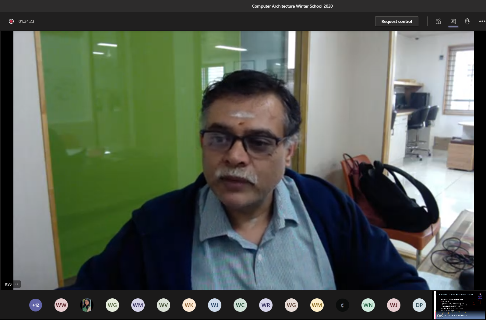
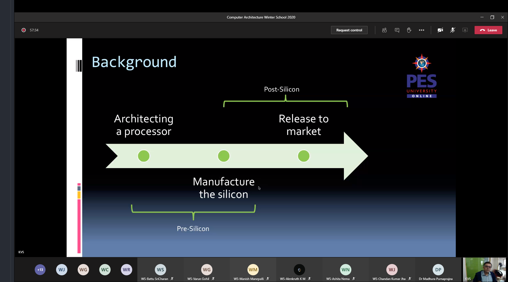
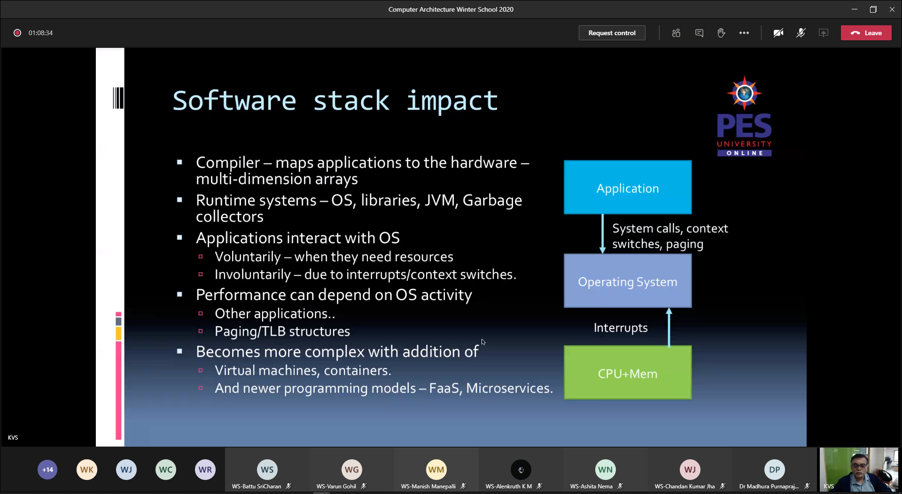
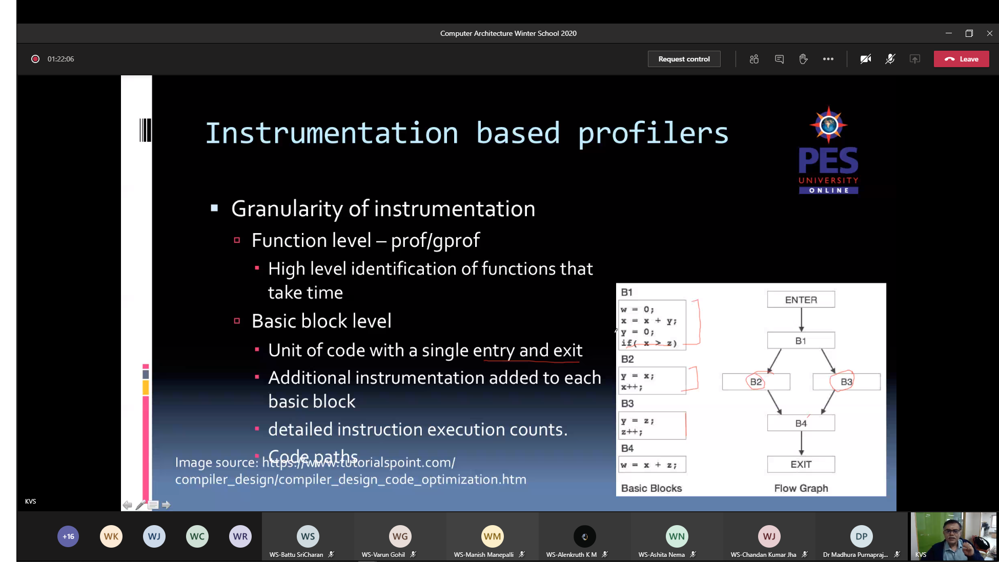
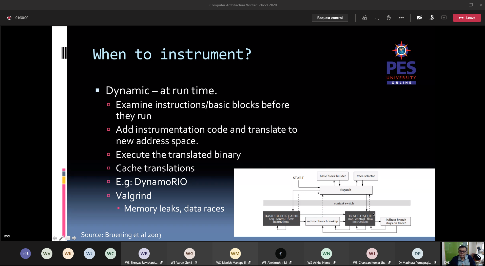
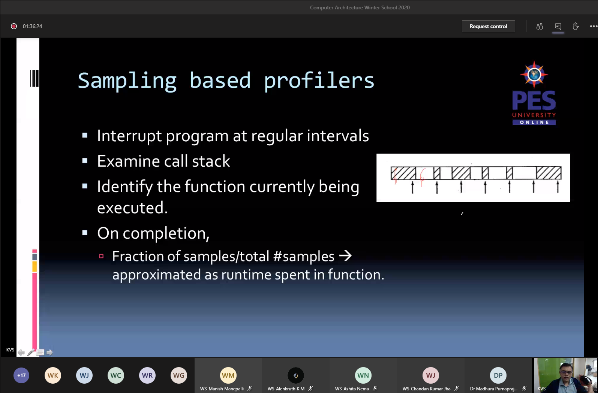
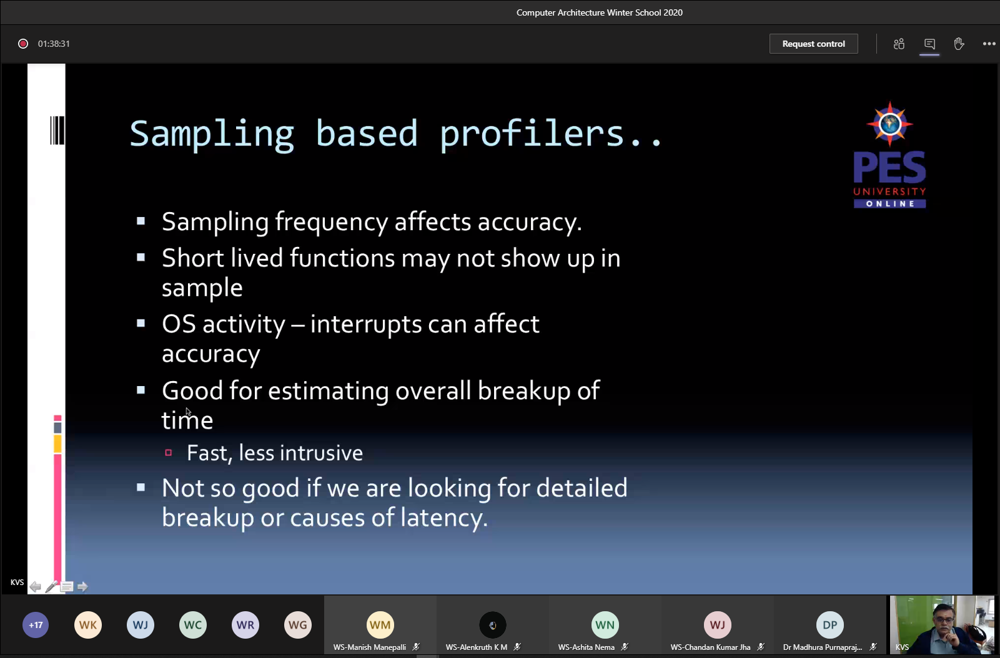
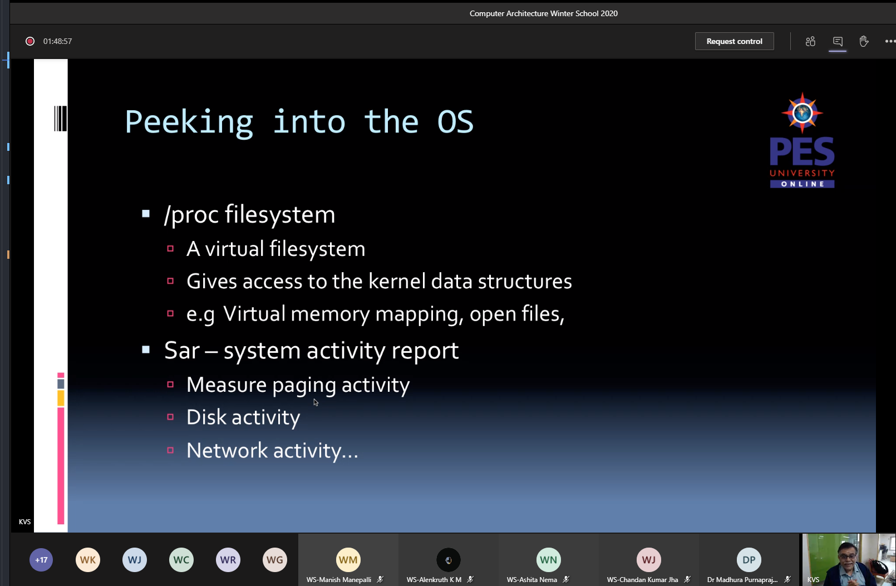
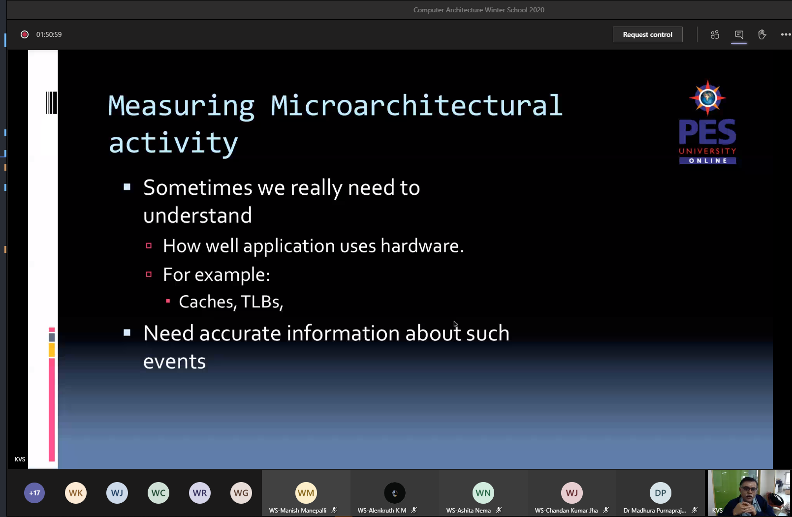
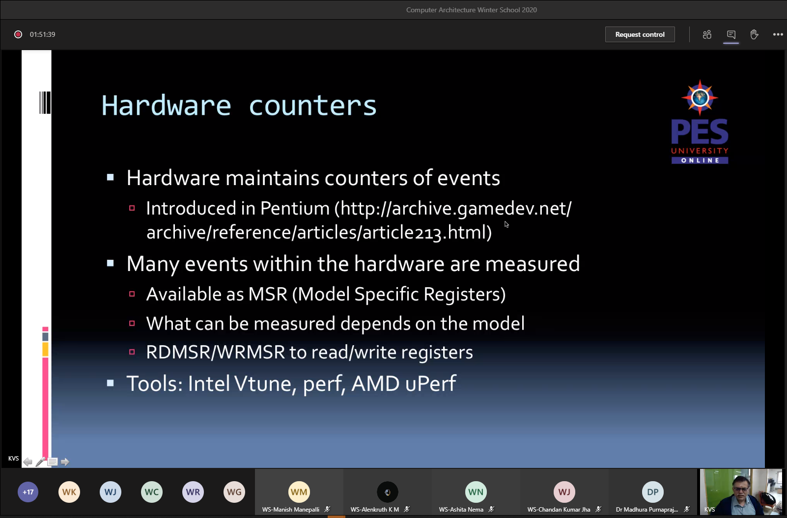

# Day 4: Performance Analysis

- [Performance tools: Prof. KV Subramaniam](#performance-tools-prof-kv-subramaniam)
  - [Questions I posted](#questions-i-posted)
- [Pre-silicon performance analysis using simulators: Dr. Kanishka Lahiri, AMD](#pre-silicon-performance-analysis-using-simulators-dr-kanishka-lahiri-amd)

## Performance tools: Prof. KV Subramaniam

Tool examples:

- prof: Function calls only
- gprof: Call graphs
- htop: Thread mapping on each core
- sar: Paging/disk activity

Measuring OS activity:

Peeking into the OS

Proc file system (virtual). Eg. cat /proc/cpuids

Measuring microarchitectural activity:

### Questions I posted

[9:35 AM] WS-Rajesh Shashi Kumar
The software impact on getting reliable performance measurements was mentioned earlier. How does one ensure that the performance instrumentation itself does not affect the accuracy of measurements? Also, for granular measurements (when there are overheads of instrumentation etc.), the OS can probably distinguish between processes, but at the cycle level I can't think of anything to be able to have the same level of granularity.

More detailed the instrumentation/measurements reduce the accuracy of time (less we can rely on the performance numbers due to overhead but more we can rely on counts). The tradeoff needs to be made. For more detailed timing, instru. should be less

## Pre-silicon performance analysis using simulators: Dr. Kanishka Lahiri, AMD

- Notion of Cycle-Accuracy: Ability of a simulator to be able to predict the cycle-by-cycle behavior of RTL
- Physical cores is called the CPU
- Cores (logical CPUs) are logical views (can be multiple) to software by simultaneous multi-threading
- "A great model is useless without proper workloads to drive it. Representativeness is key". Workloads to drive server CPU performance models:
  - SPEC CPU 2006/2017
    - Workhorse CPU throughput/speed benchmark
    - GCC/Optimizing compilers
  - Enterprise
    - SPECJbb15
    - Traditional Databases (TPC-C)
  - Cloud
    - Spark/Hadoop
    - ML
  - HPC
    - DGEMM, FFT
    - LS-Dyna3D
  - Virtualization
    - SPECVirtSC 2013
    - VMMark
  - Microbenchmarks
- Cycle acccurate simulators run at very low frequencies (~10KHz)