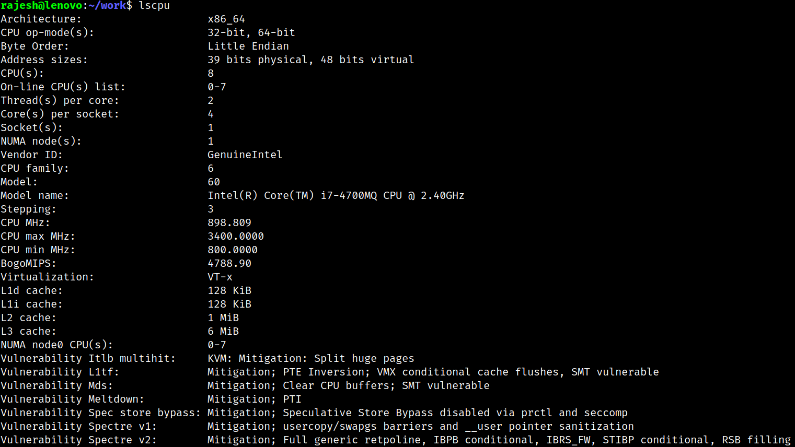
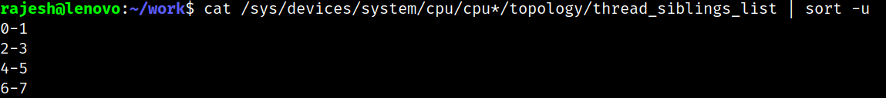
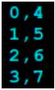

# Performance Analysis and Tooling

- [Getting Started](#getting-started)
- [System Configuration](#system-configuration)
- [Task 1: Multithreaded Pi](#task-1-multithreaded-pi)

## Getting Started

The objective of this lab is to get familiar with some of the performance measurement tools and then use them to debug performance. We will be using the following tools:

- htop - To identify the various threads of a process and the cores on which they run.
(apt-get install htop)
- sar - monitoring system activity like page faults. (apt-get install sysstat)
- gprof - Using a profiler to identify the hotspots in the program
- perf - To identify the various architectural parameters such as cache misses. To install:
 ``` apt-get install linux-tools-common linux-tools-generic linux-tools-`uname -r` (If
that fails, apt-get install linux-tools-4.15.0-118-generic)```

## System Configuration



Finding hyperthread core (logical) number:

```cat /sys/devices/system/cpu/cpu*/topology/thread_siblings_list | sort -u```



This command uses the /sys filesystem to determine the cores and their hyperthreads. This output is interpreted as - Every core can run 2 threads, Core 0 is the physical core and its hyperthread is Core 4.



## Task 1: Multithreaded Pi

```gcc -g -lm -pthread -o MT_Pi MT_Pi.c```

-g: Produce debugging information in the operating system’s native format (stabs, COFF, XCOFF, or DWARF). GDB can work with this debugging information. Instruments the binary
-pthread: (Preprocessor option) Define additional macros required for using the POSIX threads library. You should use this option consistently for both compilation and linking
-lm: Option to include the math library at compile time
-O3: Allows compiler to apply high number of optimizations. (man cc shows the list of optimizations applied on gcc)

```bash
PID=$!
htop -p $PID
```

Paging stats
``` taskset -c 0-3 ./MT_Pi 4 2> /dev/null & sar -P 0,1,2,3 -B 1 15 ```

Linux has 2 kinds of page faults:

- Major faults: Disk to memory required
- Minor faults: Present in memory but not mapped to application (shared page)

The /proc filesystem contains all the information about the process. For example, if we wanted to see the currently mapped memory regions relevant to the process -

```bash
    $ ./MT_Pi 4 &
    $ PID=$!
    $ cat /proc/$PID/maps (Observe the dyn-linked libraries pthread lib)
```

The time command:
OS updates its notion of time using CPU timer interrupts. At this time, it checks processes running in user/kernel space and returns the vales. For system commands (OS tasks) such as ls, the time measured will be entirely kernel (sys) time not user

gprof shows the call stack, sequence and time spent in each

The perf tool in Linux helps us monitor various software and hardware events. To list all the
events available on your system use ‘perf list’

```objdump -d <binary>``` gives the disassembled code that can be compared between compilers to figure out optimizations applied